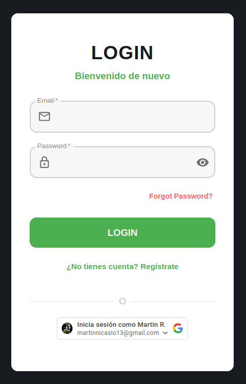
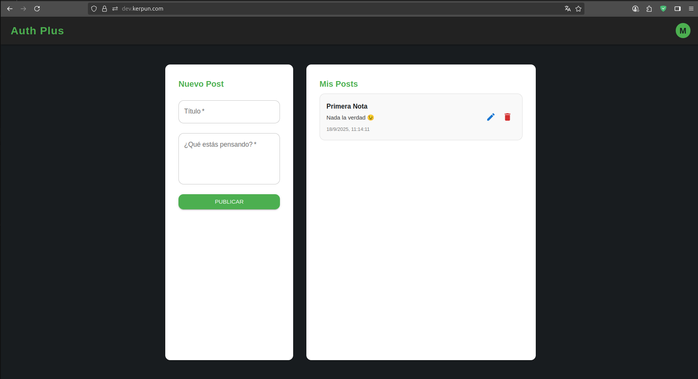

# ⚛️ AuthFront Explorer: Proyecto de Autenticación con React

  <b>🔗 Demo online:</b> <a href="https://dev.kerpun.com" target="_blank">dev.kerpun.com</a>

## 🖼️ Vistas de la Aplicación

  
   
  <b>Pantalla de Login</b>

  
   
  <b>Pantalla Principal (Home)</b>

---

Aplicación React para autenticación moderna: registro, login tradicional y Google, sesiones JWT y rutas protegidas. Interfaz responsive y comunicación con API REST.

---

## 🚀 Stack
- React
- React Router
- Material-UI
- @react-oauth/google
